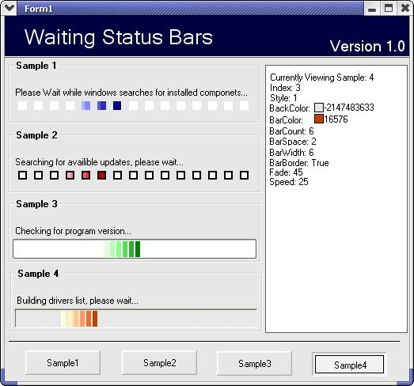



## Thinker \(Waiting Bar\) Control

### Description

This is a control used to display that your program is doing something, such as checking the internet for updates or checking for previously installed applications. Sort of a "please wait while" control. Basicly fully customizeable. Many options. Rate it if you like it.
 
### More Info
 

             |
---                |---
**Submitted On**   |2005-03-03 18:50:08
**By**             |[Eric Wolcott](https://github.com/Planet-Source-Code/PSCIndex/blob/master/ByAuthor/eric-wolcott.md)
**Level**          |Advanced
**User Rating**    |4.9 (49 globes from 10 users)
**Compatibility**  |VB 5\.0, VB 6\.0
**Category**       |[Custom Controls/ Forms/  Menus](https://github.com/Planet-Source-Code/PSCIndex/blob/master/ByCategory/custom-controls-forms-menus__1-4.md)
**World**          |[Visual Basic](https://github.com/Planet-Source-Code/PSCIndex/blob/master/ByWorld/visual-basic.md)
**Archive File**   |[Thinker\_\(W186160362005\.zip](https://github.com/Planet-Source-Code/eric-wolcott-thinker-waiting-bar-control__1-59341/archive/master.zip)

